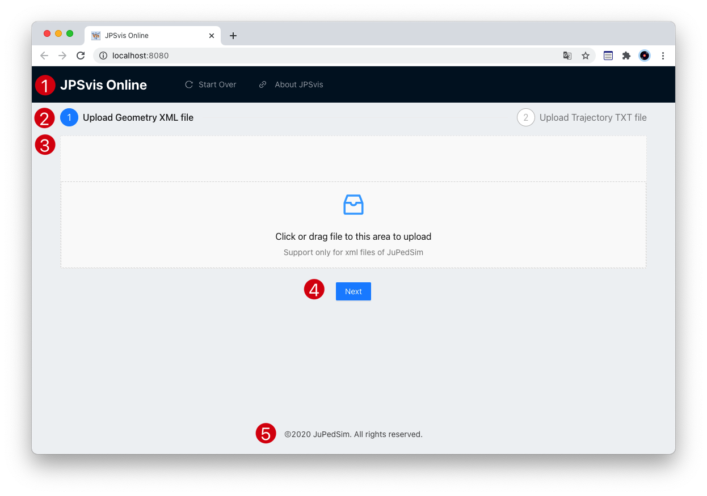
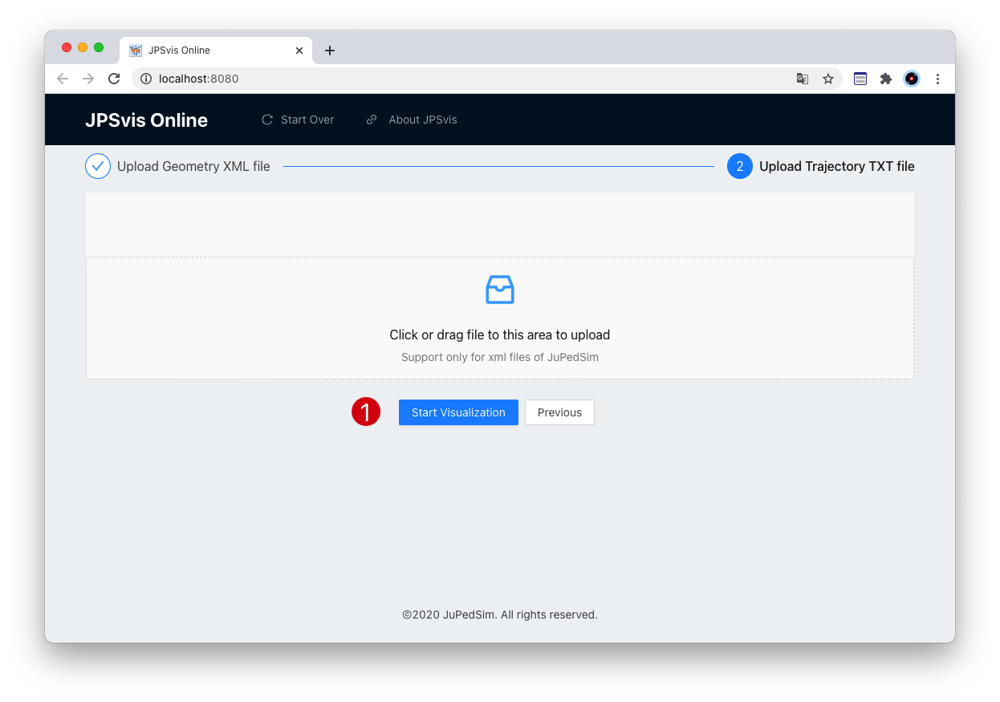
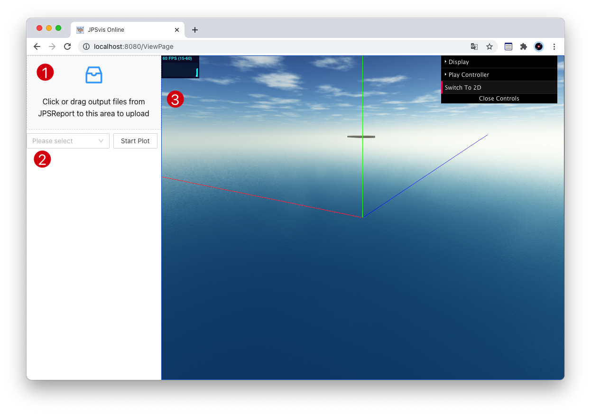
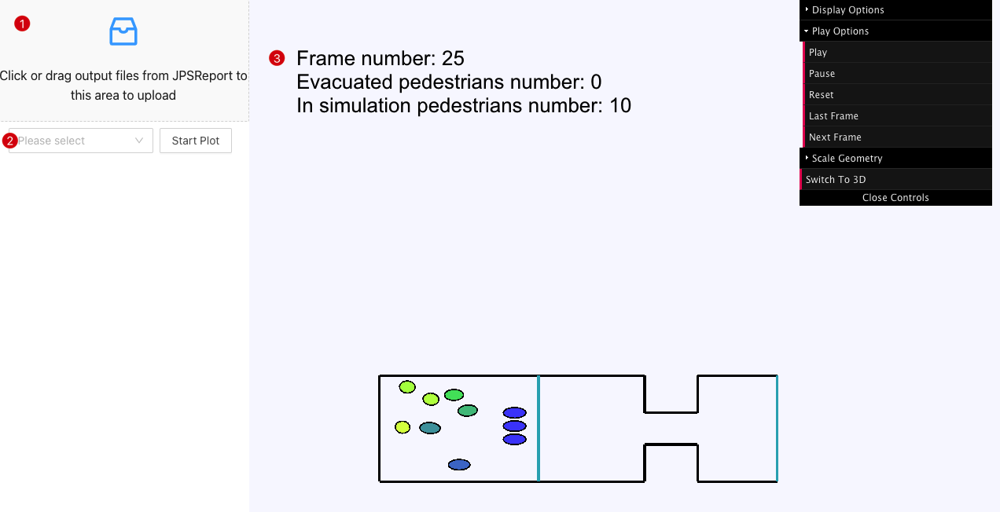
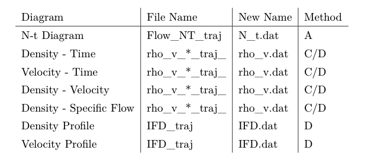

*Download [demo files](assets/Bottleeck.zip)*
- - -
## Upload files for the visualisation

Drag or click the area 3 to upload the geometry file. Notice: The geometry file must be exported from JPSeditor, to make sure its format is vaild with the JPSvis Online.

Click 'Next' button when the upload is successful. Skip to the page to upload trajectory file. Click 'Start Visualization' when the upload is finshed. The 3D view will show up.

## 3D view

When the viewing page opened, the 3D view will be shown automatically. Area 1 is for uploading outputs file for generateing diagrams, Area 2 is for choosing the type of diagram. Area 3 is for the visualisation. You can interact with mouse with the 3D view:

* Left mouse button: Press left moust button and move mouse to adjust the angle of camera;
* Middle wheel: Scoll the middle wheel to change the height of camera;
* Right mouse button: Press rigth moust button and move mouse to pan the camera.

The pedestrains will be added into the scene, use the menu on the top right corner to play, pause and reset movetion of pedestrians.

Click the 'Switch to 2D' button in the menu to the 2D view.

## 2D view

In the 2D view, You can also interact with mouse with the it:
* Left mouse button: Press left moust button and move mouse to pan the scene;
* Middle wheel: Scoll the middle wheel to zoom in or zoom out;

In the 2D view, the left top will show the necessary informations. You can play, pause and reset the movement of pedestrians throught the menu. Besides, you can control the frame number by 'Last Frame' and 'Next Frame' buttons.

In the control menu, you can check the ID of pedestrians by clicking 'ID' button, the movement of pedestrians will stop, you need to click the 'Play animation' button to continue playing simulation.

## Analysis
To generate diagramm, the output files from JPSreport is needed. The files and corresponding diagrams are shown in the following table:

Upload the files and choose the type of diagram, clicking the 'Start Plot' button, the diagram will show up in a pop-up window. Click rigth mouse button to download it.
